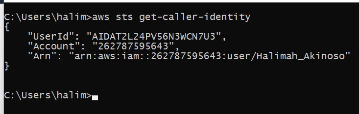

# week 0 - Billing and Architecture

## Required Homework/Task

### Install AWS CLI and Ensure that is working
 I was not use gitpod on GitHubd codespace because i dont want to exhaust
my free tier yet and i decided to use a local environment.

In order to prove that am able to install AWS CLI.
I am providing the instruction i used to for my configuration of my local machine on windows.

I did the following instruction to install AWS CLI.

I installed the AWS CLI via the command in **command Promt**:

I follow instruction on [AWS CLI install documentation page](https://docs.aws.amazon.com/cli/latest/userguide/getting-started-install.html)


```
msiexec.exe /i https://awscli.amazonaws.com/AWSCLIV2.msi
```


I attempted to run the command by typing in 'aws'  but i recieved an errors.


i was able to resolve the error by closing current command prompt and open it again.

### Create a Budget
I  was able to create budget alert for 10$ because i cannot afford any spend.


### Recreate Logical Architectural design


[Lucid chart share link](https://lucid.app/lucidchart/455168fe-db0d-46d1-96f6-eae65544f194/edit?viewport_loc=-908%2C-411%2C4252%2C2044%2C0_0&invitationId=inv_81a0af4c-6578-4f7d-980d-42122ceac090)

## Homework Challenges
